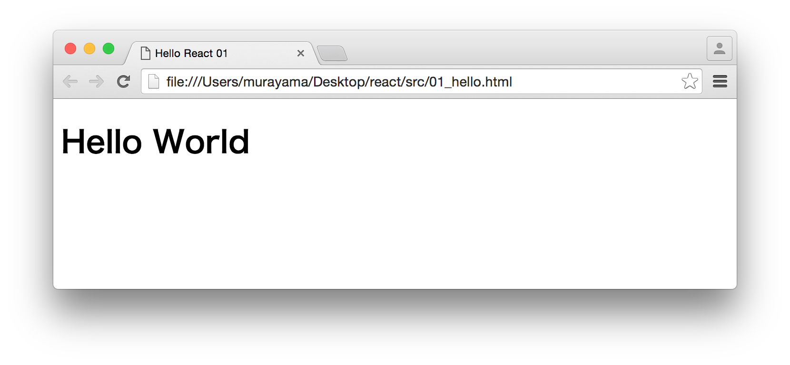

# Reactハンズオン 1/5

## Reactとは

ReactはUIをつくるためのJavaScriptライブラリです。

+ Declarative
    + 宣言的なプログラミング（たとえばExcelのsum関数）
+ Component-Based
    + コンポーネントベース（画面を構成する部品を作っていく）
+ Learn Once, Write Anywhere
    + 一度学べば、どこでも動く（Ract Nativeを使えばスマホアプリも作れる）

## Part1 Hello React - ハンズオン

ここでは次のような画面にHello Worldと表示するReactアプリケーションを作成します。



開発は以下の手順で進めます。

1. ライブラリの設定
2. コンポーネント仕様を定義
3. コンポーネントクラスをレンダリング


### 1. ライブラリの設定

Reactで配布されてるreact.js、react-dom.jsを使用します。

```javascript
<script src="https://unpkg.com/react@15.6.1/dist/react.js" charset="utf-8"></script>
<script src="https://unpkg.com/react-dom@15.6.1/dist/react-dom.js" charset="utf-8"></script>
```

また、JSXをサポートするためにBabelのbrowser.min.jsを使用します。

```
<script src="https://unpkg.com/babel-standalone@6.15.0/babel.js"></script>
```

ここまでの作業をまとめると以下のとおりです。ファイル名は01_hello.htmlという名前で保存しておきます。

```javascript
<!DOCTYPE html>
<html>
<head>
    <meta charset="utf-8">
    <title>Hello React 01</title>
    <script src="https://unpkg.com/react@15.6.1/dist/react.js" charset="utf-8"></script>
    <script src="https://unpkg.com/react-dom@15.6.1/dist/react-dom.js" charset="utf-8"></script>
    <script src="https://unpkg.com/babel-standalone@6.15.0/babel.js"></script>
</head>
<body>
</body>
</html>
```


### 2. コンポーネント仕様を定義

これからJavaScriptをゴリゴリ記述していくので、HTMLファイルのbodyタグの中にscriptタグを定義します。scriptタグのtype属性にはtext/babelを指定してください。JSXシンタックスが利用できます。

```html
<body>
  <div id="example"></div>
  <script type="text/babel">
  </script>
</body>
```

divタグはこれから作成するコンポーネントのコンテナとなる要素です。

ここでは画面にHello Worldと出力するコンポーネント仕様を定義し、コンポーネントクラスHelloWorldを作成します。ReactはコンポーネントをJSXで定義可能です。

scriptタグの中に以下のコードを記述します。

```javascript
class HelloWorld extends React.Component {
  render() {
    return <h1>Hello World</h1>;
  }
}
```

ここではES2015のオブジェクト指向構文から導入されたclass命令を使ってクラスを定義しています。ここで定義したHelloWorldクラスはReact.Componentを継承しています。このようなクラスはReactコンポーネントと呼ばれます。Reactコンポーネントには必ずrenderメソッドを定義しなくてはいけません。

> renderメソッドの内部では、戻り値がHTMLのようになっています。このような表記法はJSXと呼ばれ、コンポーネントを手軽に記述することができます。JSXをサポートするにはbabelライブラリを読み込む必要があります。JSXの利用は任意です。


### 3. コンポーネントクラスをレンダリング

作成したコンポーネントクラスを画面にレンダリングします。ReactDOM.renderメソッドの引数にコンポーネントクラス、コンポーネントのコンテナとなるDOM要素を指定します。


```javascript
ReactDOM.render(<HelloWorld />, document.getElementById('example'));  
```

ここまでの作業をまとめると次のようになります。

```javascript
<!DOCTYPE html>
<html>
<head>
    <meta charset="utf-8">
    <title>Hello React 01</title>
    <script src="https://unpkg.com/react@15.6.1/dist/react.js" charset="utf-8"></script>
    <script src="https://unpkg.com/react-dom@15.6.1/dist/react-dom.js" charset="utf-8"></script>
    <script src="https://unpkg.com/babel-standalone@6.15.0/babel.js"></script>
</head>
<body>
    <div id="example"></div>
    <script type="text/babel">
    class HelloWorld extends React.Component {
      render() {
        return <h1>Hello World</h1>;
      }
    }

    ReactDOM.render(<HelloWorld />, document.getElementById('example'));  
    </script>
</body>
</html>
```
