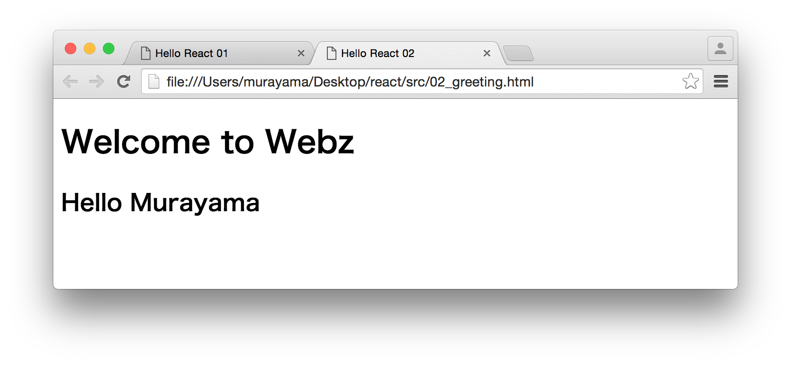

# Reactだけ学ぶハンズオン 2/5

## Part2 Greeting - ハンズオン

ここでは次のようなメッセージを表示するReactアプリケーションを作成します。



> Webzは勉強会（コミュニティ）の名前です。気にせずに。

開発は以下の手順で進めます。

1. ライブラリの設定
2. コンポーネント仕様を定義
3. コンポーネントクラスをレンダリング


### 1. ライブラリの設定

titleタグ以外は前章と同じです。ファイル名は02_greeting.htmlという名前で保存しておきます。

```html
<!DOCTYPE html>
<html>
<head>
  <meta charset="utf-8">
  <title>Hello React 02</title>
  <script src="https://unpkg.com/react@15.6.1/dist/react.js" charset="utf-8"></script>
  <script src="https://unpkg.com/react-dom@15.6.1/dist/react-dom.js" charset="utf-8"></script>
  <script src="https://unpkg.com/babel-standalone@6.15.0/babel.js"></script>
</head>
<body>
  <div id="example"></div>
  <script type="text/babel">
  </script>
</body>
</html>
```


### 2. コンポーネント仕様を定義

Reactのコンポーネントクラスを定義するために、コンポーネント仕様を作成します。

```javascript
class Greeting extends React.Component {
  render() {
    return (
      <div>
        <h1>Welcome to Webz</h1>
        <h2>Hello {this.props.name}</h2>
      </div>
    );
  }
}
```

renderメソッドではJSXを使ってコンポーネントを定義していますが、h2タグの中で{this.props.name}を指定しています。これはReactのプロパティという仕組みを使っています。プロパティとはReactコンポーネントの外部インタフェースです。ここでは外部から指定されたnameプロパティを表示するようにしています。nameプロパティの指定は、後のレンダリング時に指定します。


### 3. コンポーネントクラスをレンダリング

作成したコンポーネントクラス（Greeting）を画面にレンダリングします。前章とほとんど同じですが、Greetingコンポーネントにnameプロパティを指定している点を確認しておいてください。


```javascript
var name = "Murayama";
ReactDOM.render(
  <Greeting name={name} />,
  document.getElementById('example')
);
```

ここまでの作業をまとめると次のようになります。

```html
<!DOCTYPE html>
<html>
<head>
  <meta charset="utf-8">
  <title>Hello React 02</title>
  <script src="https://unpkg.com/react@15.6.1/dist/react.js" charset="utf-8"></script>
  <script src="https://unpkg.com/react-dom@15.6.1/dist/react-dom.js" charset="utf-8"></script>
  <script src="https://unpkg.com/babel-standalone@6.15.0/babel.js"></script>
</head>
<body>
  <div id="example"></div>
  <script type="text/babel">
  class Greeting extends React.Component {
    render() {
      return (
        <div>
          <h1>Welcome to Webz</h1>
          <h2>Hello {this.props.name}</h2>
        </div>
      );
    }
  }

  var name = "Murayama";
  ReactDOM.render(
    <Greeting name={name} />,
    document.getElementById('example')
  );
  </script>
</body>
</html>
```
