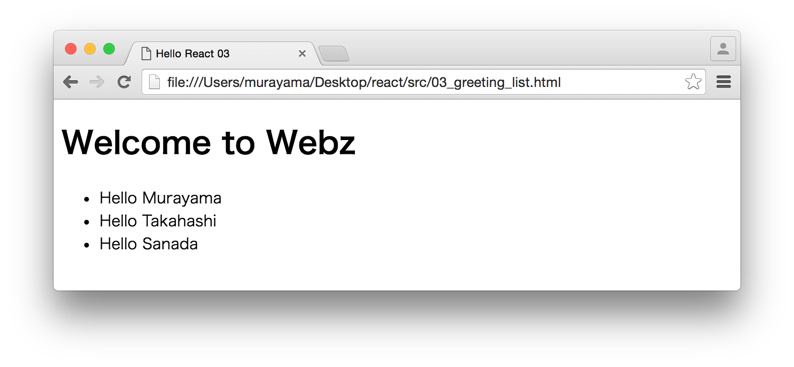

# Reactハンズオン 3/5

## Part3 GreetingList - ハンズオン

ここでは次のようなメッセージ一覧を表示するReactアプリケーションを作成します。



開発は以下の手順で進めます。

1. ライブラリの設定
2. コンポーネント仕様を定義
3. コンポーネントクラスをレンダリング

### 1. ライブラリの設定

titleタグ以外は前章と同じです。ファイル名は03_greeting_list.htmlという名前で保存しておきます。

```javascript
<!DOCTYPE html>
<html>
<head>
    <meta charset="utf-8">
    <title>Hello React 03</title>
    <script src="https://cdnjs.cloudflare.com/ajax/libs/react/15.0.1/react.js" charset="utf-8"></script>
    <script src="https://cdnjs.cloudflare.com/ajax/libs/react/15.0.1/react-dom.js" charset="utf-8"></script>
    <script src="https://cdnjs.cloudflare.com/ajax/libs/babel-core/5.8.23/browser.min.js"></script>
</head>
<body>
</body>
</html>
```

### 2. コンポーネント仕様を定義

Reactのコンポーネントクラスを定義するために、コンポーネント仕様を作成します。ここではHelloと挨拶するGreetingItemクラスと、複数のGreetingItemを管理するGreetingListクラスを定義します。

GreetingItemクラスは以下のとおりです。

```javascript
var GreetingItem = React.createClass({
    render : function(){
        return (
            <li>Hello {this.props.name}</li>
        );
    }
});
```

前章で作成したGreetingクラスとほとんど同じです。nameプロパティの内容をレンダリングします。

続いてGreetingListクラスです。

```javascript
var GreetingList = React.createClass({
    render: function(){
        var greetingItems = this.props.names.map(function(name, i){
            return (<GreetingItem name={name} key={i} />);
        });

        return (
            <div>
            <h1>Welcome to Webz</h1>
            <ul>{greetingItems}</ul>
            </div>
        );
    }
});
```

GreetingListコンポーネントはnamesプロパティから名前の配列を受け取ります。実際の値の受け渡しは後のrenderフェーズで指定します。

renderメソッドではnamesプロパティをループして、JSXを使ってGreetingItem要素を定義しています。Reactは仮想DOMを使って要素を管理しているので、各要素にはkey属性を指定して一意な値を定義する必要があります。

### 3. コンポーネントクラスをレンダリング

作成したコンポーネントクラス（GreetingList）を画面にレンダリングします。GreetingListコンポーネントにnamesプロパティを指定している点を確認しておいてください。


```javascript
var names = ["Murayama", "Takahashi", "Sanada"];
ReactDOM.render(
    <GreetingList names={names} />,
    document.getElementById('example')
);
```

ここまでの作業をまとめると次のようになります。

```javascript
<!DOCTYPE html>
<html>
<head>
    <meta charset="utf-8">
    <title>Hello React 03</title>
    <script src="https://cdnjs.cloudflare.com/ajax/libs/react/15.0.1/react.js" charset="utf-8"></script>
    <script src="https://cdnjs.cloudflare.com/ajax/libs/react/15.0.1/react-dom.js" charset="utf-8"></script>
    <script src="https://cdnjs.cloudflare.com/ajax/libs/babel-core/5.8.23/browser.min.js"></script>
</head>
<body>
    <div id="example"></div>
    <script type="text/babel">
    var GreetingItem = React.createClass({
        render : function(){
            return (
                <li>Hello {this.props.name}</li>
            );
        }
    });

    var GreetingList = React.createClass({
        render: function(){
            var greetingItems = this.props.names.map(function(name, i){
                return (<GreetingItem name={name} key={i} />);
            });

            return (
                <div>
                <h1>Welcome to Webz</h1>
                <ul>{greetingItems}</ul>
                </div>
            );
        }
    });

    var names = ["Murayama", "Takahashi", "Sanada"];
    ReactDOM.render(
        <GreetingList names={names} />,
        document.getElementById('example')
    );
    </script>
</body>
</html>
```
