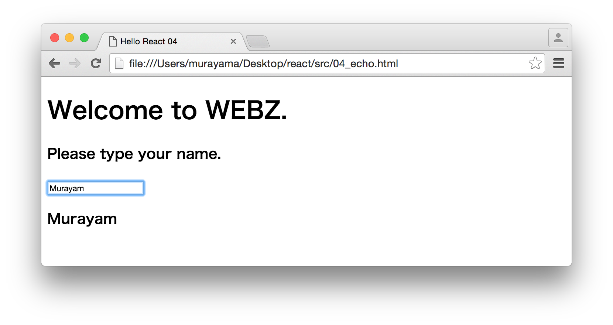

# Reactだけ学ぶハンズオン 4/5

## Part4 Echo - ハンズオン

ここでは入力した内容を表示するReactアプリケーションを作成します。



開発は以下の手順で進めます。

1. ライブラリの設定
2. コンポーネント仕様を定義
3. コンポーネントクラスをレンダリング

### 1. ライブラリの設定

titleタグ以外は前章と同じです。ファイル名は04_echo.htmlという名前で保存しておきます。

```html
<!DOCTYPE html>
<html>
<head>
  <meta charset="utf-8">
  <title>Hello React 04</title>
  <script src="https://unpkg.com/react@15.6.1/dist/react.js" charset="utf-8"></script>
  <script src="https://unpkg.com/react-dom@15.6.1/dist/react-dom.js" charset="utf-8"></script>
  <script src="https://unpkg.com/babel-standalone@6.15.0/babel.js"></script>
</head>
<body>
  <div id="example"></div>
  <script type="text/babel">
  </script>
</body>
</html>
```

### 2. コンポーネント仕様を定義

ここでは画面の入力を受け付けるテキストボックスと、入力された名前を表示する領域を持ったとEchoコンポーネントクラスを作成します。

Echoコンポーネントの仕様は以下のとおりです。

```javascript
class Echo extends React.Component {
  constructor(props) {
    super(props);
    this.state = {name: ""};
    // bind this
    this.echo = this.echo.bind(this);
  }

  echo(e){
    this.setState({name: e.target.value});
  }

  render() {
    return (
      <div>
        <h1>Welcome to WEBZ.</h1>
        <h3>Please type your name.</h3>
        <input type="text" onChange={this.echo} />
        <h3>{this.state.name}</h3>
      </div>
    );
  }
}
```

renderメソッド以外にconstructor、echoメソッドの2つが追加されています。constructorの説明に入る前にReactのステートについて学習しておきましょう。

Reactにはステートという仕組みがあります。ステートとはコンポーネントの状態を表すものです。上記のEchoコンポーネントには「（入力された）名前」を示すnameというステートがあります。Reactのコンポーネントはステートの内容が更新されると自動的に再描画（renderメソッド呼び出し）されるようになっています。

constructorはReactコンポーネントのライフサイクルメソッドの1つで、コンポーネントインスタンスの生成時に呼び出されます。constructorでステートの初期値を設定できます。

```javascript
constructor(props) {
  super(props);
  this.state = {name: ""};
  // bind this
  this.echo = this.echo.bind(this);
}
```

上記のコードではnameステートの初期値を空文字で設定しています。

> this.echo = this.echo.bind(this); は後の echoメソッド を利用できるようにしています。

つづいてechoメソッドを見てみましょう。

```javascript
echo(e){
  this.setState({name: e.target.value});
}
```

echoメソッドはReactの仕組みに依存したものではなく、アプリケーション独自のメソッドです。echoメソッドはrenderメソッドの中でinputタグのonChangeイベントハンドラに関連付けられています。

```html
<input type="text" onChange={this.echo} />
```

これによって、テキストボックスの値に変化が生じるとechoメソッドが呼び出されるようになります。echoメソッドの中では、コンポーネントのステートを更新するためにsetStateメソッドを呼び出しています。Reactは内部で仮想DOMによってコンポーネントを管理しているため、ステートを更新する場合、必ずsetStateメソッドを使用する必要があります。

> this.state.name = e.target.value; のように記述してはいけません。

echoメソッドによってステートが更新されるとコンポーネントのrenderメソッドがReactによって呼び出されます。

```javascript
render() {
  return (
    <div>
      <h1>Welcome to WEBZ.</h1>
      <h3>Please type your name.</h3>
      <input type="text" onChange={this.echo} />
      <h3>{this.state.name}</h3>
    </div>
  );
}
```

これによってテキストボックスに入力した内容が即座に画面に表示されるようになります。


### 3. コンポーネントクラスをレンダリング

作成したコンポーネントクラス（Echo）を画面にレンダリングします。

```javascript
ReactDOM.render(
  <Echo />,
  document.getElementById('example')
);
```

Echoコンポーネントにプロパティの指定はありません。

ここまでの作業をまとめると次のようになります。

```html
<!DOCTYPE html>
<html>
<head>
  <meta charset="utf-8">
  <title>Hello React 04</title>
  <script src="https://unpkg.com/react@15.6.1/dist/react.js" charset="utf-8"></script>
  <script src="https://unpkg.com/react-dom@15.6.1/dist/react-dom.js" charset="utf-8"></script>
  <script src="https://unpkg.com/babel-standalone@6.15.0/babel.js"></script>
</head>
<body>
  <div id="example"></div>
  <script type="text/babel">

  class Echo extends React.Component {
    constructor(props) {
      super(props);
      this.state = {name: ""};
      // bind this
      this.echo = this.echo.bind(this);
    }

    echo(e){
      this.setState({name: e.target.value});
    }

    render() {
      return (
        <div>
          <h1>Welcome to WEBZ.</h1>
          <h3>Please type your name.</h3>
          <input type="text" onChange={this.echo} />
          <h3>{this.state.name}</h3>
        </div>
      );
    }
  }

  ReactDOM.render(
    <Echo />,
    document.getElementById('example')
  );
  </script>
</body>
</html>
```
