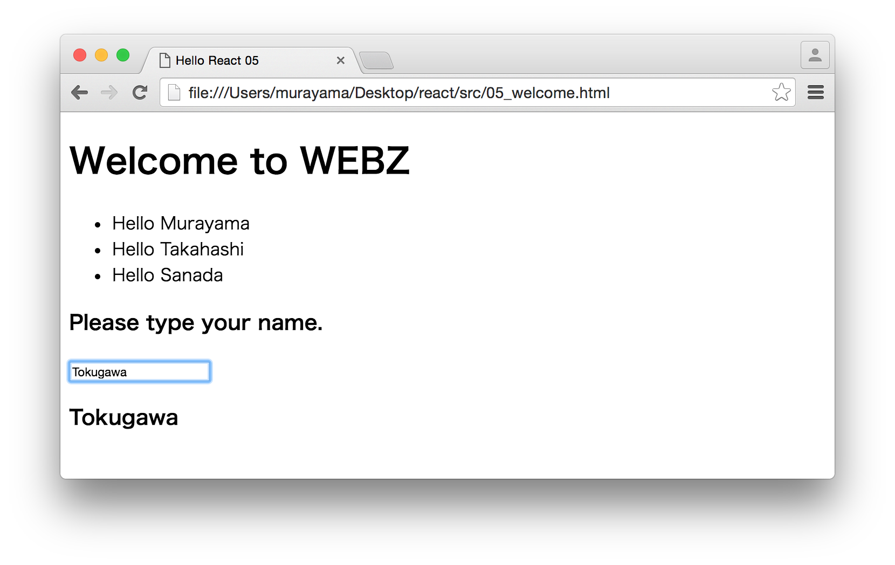

# Reactだけ学ぶハンズオン 5/5

## Part5 Welcome - ハンズオン

ここでは入力した内容を表示するReactアプリケーションを作成します。



開発は以下の手順で進めます。

1. ライブラリの設定
2. コンポーネント仕様を定義
3. コンポーネントクラスをレンダリング

### 1. ライブラリの設定

titleタグ以外は前章と同じです。ファイル名は05_welcome.htmlという名前で保存しておきます。

```html
<!DOCTYPE html>
<html>
<head>
  <meta charset="utf-8">
  <title>Hello React 05</title>
  <script src="https://unpkg.com/react@15.6.1/dist/react.js" charset="utf-8"></script>
  <script src="https://unpkg.com/react-dom@15.6.1/dist/react-dom.js" charset="utf-8"></script>
  <script src="https://unpkg.com/babel-standalone@6.15.0/babel.js"></script>
</head>
<body>
  <div id="example"></div>
  <script type="text/babel">
  </script>
</body>
</html>
```

### 2. コンポーネント仕様を定義

ここでは以下のコンポーネントを作成します。

+ Welcome
    + GreetingList
        + GreetingItem(\*)
    + Echo

各コンポーネント仕様は次のようになります。

```javascript
class GreetingItem extends React.Component {
  render() {
  }
}

class GreetingList extends React.Component {
  render() {
  }
}

class Echo extends React.Component {
  constructor(props) {
  }

  echo(e){
  }

  isEnterKey(e){
  }

  render() {
  }
}

class Welcome extends React.Component {
  constructor(props) {
  }

  save(completeName){
  }

  echo(incompleteName){
  }

  render(){
  }
}
```

コードが長くなるので順に見ていきましょう。まずはGreetingItemとGreetingListです。

```javascript
class GreetingItem extends React.Component {
  render() {
    return (
      <li>Hello {this.props.name}</li>
    );
  }
}

class GreetingList extends React.Component {
  render() {
    var greetingItems = this.props.names.map(function(name, i){
        return <GreetingItem name={name} key={i} />;
    });

    return (
      <div>
        <h1>Welcome to Webz</h1>
        <ul>{greetingItems}</ul>
      </div>
    );
  }
}
```

GreetingItem、GreetingListについては以前に作成した内容と同じです。GreetingListのnamesプロパティに名前の配列を設定することで、個々の名前が子要素のGreetingItemのnameプロパティに設定されます。

つづいてEchoコンポーネントです。

```javascript
class Echo extends React.Component {
  constructor(props) {
    super(props);
    // bind this
    this.echo = this.echo.bind(this);
    this.isEnterKey = this.isEnterKey.bind(this);
  }

  echo(e){
    this.props.onChange(e.target.value);
  }

  isEnterKey(e){
    if (e.keyCode == 13) {
      this.props.onSave(e.target.value);
    }
  }

  render() {
    return (
      <div>
        <h3>Please type your name.</h3>
        <input type="text" onChange={this.echo} onKeyDown={this.isEnterKey} value={this.props.name}/>
        <h3>{this.props.name}</h3>
      </div>
    );
  }
}
```

Echoコンポーネントは以前に作成したものと以下の点で異なります。

1. ステートnameではなく、プロパティnameを使用している
1. echoメソッドの実装でステートの更新ではなく、onChangeプロパテイ（関数）を呼び出している
1. onKeyDownイベントハンドラでisEnterKeyメソッドを呼び出している

#### 1. ステートnameではなく、プロパティnameを使用している

Reactで、複合コンポーネントを作成する場合、可能な限りステートの管理は親コンポーネントで管理するようにします。

+ Welcome
    + GreetingList
        + GreetingItem(\*)
    + Echo

上記の場合、ステートはWelcomeコンポーネントで管理すべきです。従って入力中の名前を示すnameプロパティをWelcomeコンポーネントで定義し、代わりにEchoコンポーネントには、Welcomeコンポーネントとの外部インタフェースとなるnameプロパティを用意します。親コンポーネントのステートの変更をnameプロパティ経由で受け取るようにします。

```javascript
render() {
  return (
    <div>
      <h3>Please type your name.</h3>
      <input type="text" onChange={this.echo} onKeyDown={this.isEnterKey} value={this.props.name}/>
      <h3>{this.props.name}</h3>
    </div>
  );
}
```

#### 2. echoメソッドの実装でステートの更新ではなく、onChangeプロパテイ（関数）を呼び出している

Echoコンポーネントからnameステートを排除したので、echoメソッドの実装は次のようにonChangeプロパティを呼び出すようにします。

```javascript
echo(e){
  this.props.onChange(e.target.value);
}
```

Echoコンポーネントを利用する親コンポーネント（今回の場合Welcomeコンポーネント）では次のようにプロパティを指定します。

```javascript
<Echo name={this.state.name} onChange={this.foo} onSave={this.bar}/>
```

この場合、onChangeプロパティにWelcomeコンポーネントで指定したfooメソッドを指定してます。結果として、EchoコンポーネントでonChangeイベントが発生するとこのfooメソッドが呼ばれることになります。

#### 3. onKeyDownイベントハンドラでisEnterKeyメソッドを呼び出している

onKeyDownイベントハンドラのisEnterKeyメソッドは次のようになっています。

```javascript
isEnterKey(e){
  if (e.keyCode == 13) {
    this.props.onSave(e.target.value);
  }
}
```

キーコード：13とはEnterキーを意味しています。つまり、Enterキーが入力された場合、onSaveプロパティ（関数）を呼び出すようにしています。

たとえば、以下のようにEchoコンポーネントを定義しとしましょう。

```html
<Echo name={this.state.name} onChange={this.foo} onSave={this.bar}/>
```

Enterキークリック時に、onSaveプロパティで指定されたbarメソッドが呼び出されることになります。

さいごに親コンポーネントとなるWelcomeのコンポーネント仕様を実装します。

```javascript
class Welcome extends React.Component {
  constructor(props) {
    super(props);
    this.state = {
      names: this.props.names,
      name: ""
    };
    // bind this
    this.save = this.save.bind(this);
    this.echo = this.echo.bind(this);
  }

  save(completeName){
    var names = this.state.names.concat(completeName);
    this.setState({
      names: names,
      name: ""
    });
  }

  echo(incompleteName){
    this.setState({name: incompleteName});
  }

  render(){
    return(
      <div>
        <GreetingList names={this.state.names} />
        <Echo name={this.state.name} onChange={this.echo} onSave={this.save}/>
      </div>
    );
  }
}
```

constructorで初期ステートを指定します。ステートはnames配列と、name文字列の2つです。namesステートはGreetingListコンポーネントのnamesプロパティに指定し、nameステートはEchoコンポーネントのnameプロパティに指定します。

echoメソッド、saveメソッドはステートを更新します。これらのメソッドはEchoコンポーネントのイベントハンドラに指定しているので、Echoコンポーネントにおいて、イベントが発生時するとコールバックされます。

renderメソッドではGreetingListと、Echoコンポーネントをレンダリングしています。renderメソッドは単一のコンポーネントを返す必要があるので、divタグでラップしています。

### 3. コンポーネントクラスをレンダリング

作成したコンポーネントクラス（Welcome）を画面にレンダリングします。

```javascript
var names = ["Murayama", "Takahashi", "Sanada"];
ReactDOM.render(
  <Welcome names={names} />,
  document.getElementById('example')
);
```

Welcomeコンポーネントのnamesプロパティに3件の名前を指定します。こうすることで、画面描画時の初期値として表示されます。

ここまでの作業をまとめると次のようになります。

```html
<!DOCTYPE html>
<html>
<head>
  <meta charset="utf-8">
  <title>Hello React 05</title>
  <script src="https://unpkg.com/react@15.6.1/dist/react.js" charset="utf-8"></script>
  <script src="https://unpkg.com/react-dom@15.6.1/dist/react-dom.js" charset="utf-8"></script>
  <script src="https://unpkg.com/babel-standalone@6.15.0/babel.js"></script>
</head>
<body>
  <div id="example"></div>
  <script type="text/babel">
  class GreetingItem extends React.Component {
    render() {
      return (
        <li>Hello {this.props.name}</li>
      );
    }
  }

  class GreetingList extends React.Component {
    render() {
      var greetingItems = this.props.names.map(function(name, i){
          return <GreetingItem name={name} key={i} />;
      });

      return (
        <div>
          <h1>Welcome to Webz</h1>
          <ul>{greetingItems}</ul>
        </div>
      );
    }
  }

  class Echo extends React.Component {
    constructor(props) {
      super(props);
      // bind this
      this.echo = this.echo.bind(this);
      this.isEnterKey = this.isEnterKey.bind(this);
    }

    echo(e){
      this.props.onChange(e.target.value);
    }

    isEnterKey(e){
      if (e.keyCode == 13) {
        this.props.onSave(e.target.value);
      }
    }

    render() {
      return (
        <div>
          <h3>Please type your name.</h3>
          <input type="text" onChange={this.echo} onKeyDown={this.isEnterKey} value={this.props.name}/>
          <h3>{this.props.name}</h3>
        </div>
      );
    }
  }

  class Welcome extends React.Component {
    constructor(props) {
      super(props);
      this.state = {
        names: this.props.names,
        name: ""
      };
      // bind this
      this.save = this.save.bind(this);
      this.echo = this.echo.bind(this);
    }

    save(completeName){
      var names = this.state.names.concat(completeName);
      this.setState({
        names: names,
        name: ""
      });
    }

    echo(incompleteName){
      this.setState({name: incompleteName});
    }

    render(){
      return(
        <div>
          <GreetingList names={this.state.names} />
          <Echo name={this.state.name} onChange={this.echo} onSave={this.save}/>
        </div>
      );
    }
  }

  var names = ["Murayama", "Takahashi", "Sanada"];
  ReactDOM.render(
    <Welcome names={names} />,
    document.getElementById('example')
  );
  </script>
</body>
</html>
```
